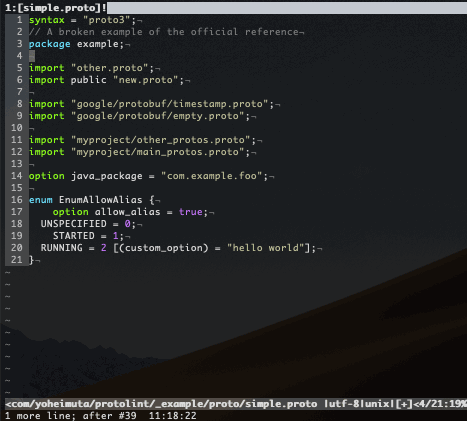

# vim-protolint

This provides Vim integration for protolint linting and fixing via the [ALE engine](https://github.com/dense-analysis/ale).

- NOTE: [The latest ale](https://github.com/dense-analysis/ale/pull/2911) supports protolint natively. If you use ale as a linting solution, this repository is in favor of the upstream support. The setting specified in .vimrc works as before. 

It also enables you to check errors with [Syntastic](https://github.com/vim-syntastic/syntastic).

## Installation

[protolint](https://github.com/yoheimuta/protolint) must be installed.
Note that the binary with **v0.22.0 or above** is supported

### Installation with Vim package management

In Vim 8 and NeoVim, you can install plugins easily without needing to use any
other tools. Simply clone the plugin into your pack directory.

```
mkdir -p ~/.vim/pack/git-plugins/start

# NOTE: In recent, dense-analysis/ale incorporated the same source code this repository has maintained. 
## Thus, you don't have to install this repository to run protolint on ale.
git clone --depth 1 https://github.com/yoheimuta/vim-protolint.git ~/.vim/pack/git-plugins/start/vim-protolint

# NOTE: Install either ale or syntastic if you haven't installed yet.
git clone --depth 1 https://github.com/dense-analysis/ale.git ~/.vim/pack/git-plugins/start/ale
git clone --depth 1 https://github.com/vim-syntastic/syntastic.git ~/.vim/pack/git-plugins/start/syntastic
```

## Demo



## Usage

### Error checking with ALE

Add the following to your .vimrc.

```vim
let g:ale_linters = {
\   'proto': ['protolint'],
\}

let g:ale_fixers = {
\   'proto': ['ale#fixers#protolint#Fix'],
\}

" We recommend you set this.
let g:ale_lint_on_text_changed = 'never'

" You can remove comment outs below if you want to configure parameters.
" let g:ale_proto_protolint_executable = "/usr/local/bin/protolint"
" let g:ale_proto_protolint_config =
"            \ "/path/to/config/.protolint.yaml"

```

See [doc/ale-proto.txt](doc/ale-proto.txt) in more detail.

### Error checking with Syntastic

Add the following to your .vimrc.

```vim
let g:syntastic_proto_checkers = ['protolint']

" You can remove comment outs below if you want to configure parameters.
" let g:syntastic_proto_protolint_exec = "/usr/local/bin/protolint"
" let g:syntastic_proto_protolint_args =
"            \ "-config_path= /path/to/config/.protolint.yaml"
```
